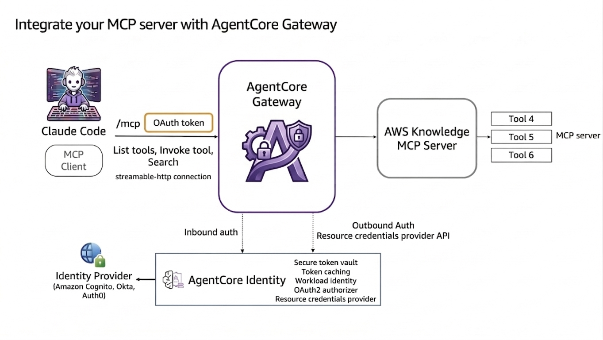

# Claude Code Gateway MCP Server

A centralized MCP (Model Context Protocol) gateway that integrates **Claude Code** with **AWS AgentCore Gateway** to streamline tool access, reduce context overhead, and simplify multi-server integrations in enterprise environments.

---

## Table of Contents

- [Overview](#overview)
- [Architecture](#architecture)
- [Key Features](#key-features)
- [Prerequisites](#prerequisites)
- [Installation](#installation)
- [Usage](#usage)
- [Sample Prompts](#sample-prompts)
- [Repository Structure](#repository-structure)
- [IAM Permissions](#iam-permissions)
- [License](#license)

- [Cleanup](#cleanup)
---

## Overview

This project demonstrates how to integrate **Claude Code** with **AWS AgentCore Gateway** to build a centralized MCP server. Instead of managing multiple MCP connections, all requests are routed through a single gateway. This approach:

- Reduces configuration complexity
- Optimizes LLM context usage
- Improves scalability in enterprise environments

| **Attribute** | **Details** |
|---------------|-------------|
| Tutorial Type | Interactive (Jupyter Notebook) |
| AgentCore Components | AgentCore Gateway, AgentCore Identity |
| Gateway Target Type | MCP Server |
| Inbound Auth IDP | Amazon Cognito (configurable) |
| Tutorial Vertical | Cross-Vertical |
| Complexity | Easy |
| SDK Used | `boto3` |

---

## Architecture



The solution follows a clean, layered architecture:

```
Claude Code ──(OAuth Token)──▶ AgentCore Gateway ──▶ AWS Knowledge MCP Server ──▶ Tools
       │
       └── Amazon Cognito (Authentication)
       └── AWS IAM Role (Backend Access)
```


### Request Flow

1. **Claude Code** sends a request with an OAuth Bearer token to the **AgentCore Gateway**
2. **Gateway** validates the token through **Amazon Cognito**
3. **Gateway** performs semantic search to determine which backend tools are needed
4. **Gateway** forwards the request to the appropriate MCP target
5. **Response** flows back through the gateway to **Claude Code**

---

## Key Features

- **Single Gateway Pattern**: Consolidates multiple MCP connections into one unified entry point
- **OAuth 2.0 Authentication**: Secure token-based access via Amazon Cognito
- **Semantic Tool Routing**: Intelligent routing based on request context
- **Zero Context Duplication**: Avoids redundant tool registration across multiple servers
- **Scalable Design**: Built to handle enterprise-scale workloads
- **Easy Integration**: Jupyter Notebook-based setup for rapid prototyping

---

## Prerequisites

### Required Software

| Tool | Version | Purpose |
|------|---------|--------|
| Python | 3.10+ | Runtime environment |
| Jupyter Notebook | Latest | Interactive development |
| Claude Code CLI | Latest | AI coding assistant |
| AWS CLI | Latest | AWS resource management |
| Git | Latest | Version control |

### AWS Account Requirements

- An AWS account with **admin permissions**
- AWS CLI configured with appropriate credentials
- Access to Amazon Bedrock AgentCore services

### Claude Code Setup

Ensure Claude Code CLI is installed and you are logged in:

```bash
claude-code login
```

---

## Installation

### 1. Clone the Repository

```bash
git clone https://github.com/vinayshinde-cloud/claude-code-gateway-mcp-server.git
cd claude-code-gateway-mcp-server
```

### 2. Create a Virtual Environment

```bash
# Create virtual environment
python3 -m venv .venv

# Activate environment
source .venv/bin/activate      # Linux/macOS
# .venv\Scripts\activate      # Windows
```

### 3. Install Dependencies

```bash
# Upgrade pip
pip install -U pip

# Install project dependencies
pip install -U -r requirements.txt
```

### 4. Launch the Notebook

```bash
jupyter notebook claude-code-gateway-mcp-server.ipynb
```

Follow the step-by-step instructions in the notebook to set up the gateway.

---

## Usage

Once the gateway is registered in Claude Code, you can interact with it using MCP commands.

### Connect to the Gateway

1. In Claude Code, run the MCP command:
   ```
   /mcp
   ```

2. Select the registered gateway (e.g., `my-tools-gw`)

3. View available tools:
   ```
   View tools
   ```

### Interact with Tools

Ask Claude Code questions that leverage the AWS Knowledge MCP Server tools exposed through the gateway. For example:

- Query AWS resource information
- Perform semantic search across AWS documentation
- Execute cloud operations through natural language

---

## Sample Prompts

| Command | Description |
|---------|-------------|
| `/mcp` | List available MCP servers |
| `View tools` | Display all tools exposed by the gateway |
| `Describe my AWS S3 buckets` | Query AWS resources via the gateway |
| `How do I optimize Lambda costs?` | Semantic search across AWS docs |

---

## Repository Structure

```
claude-code-gateway-mcp-server/
├── claude-code-gateway-mcp-server.ipynb   # Main setup & integration notebook
├── utils.py                               # Helper functions for AWS operations
├── requirements.txt                       # Python dependencies
├── images/                                # Architecture diagrams & screenshots
│   └── claude_code_agentcore_gateway_architecture_new.png
└── README.md                              # This documentation file
```

---

## IAM Permissions

The following IAM permissions are required to run this project:

```json
{
  "iam": ["CreateRole", "PutRolePolicy", "PassRole"],
  "cognito-idp": ["*"],
  "bedrock-agentcore": ["*"]
}
```

> **Note**: For production use, follow the **principle of least privilege** and scope permissions to specific resources.

---


**Built with** 
- Claude Code
- AWS AgentCore
- Amazon Cognito
- Python & boto3


## Cleanup

The notebook includes cleanup cells to:

1. Delete the AgentCore Gateway and its targets
2. Remove the MCP server from Claude Code (`claude mcp remove my-tools-gw`)

### Additional Resources to Delete

Additional resources you may need to manually delete:

| Resource | Name |
|----------|------|
| IAM Role & Policies | `sample-claude-code-mcp-gateway` |
| Cognito User Pool | `sample-agentcore-gateway-pool` |

> **Tip**: Use the AWS Console or AWS CLI to verify and delete any remaining resources to avoid unexpected charges.
